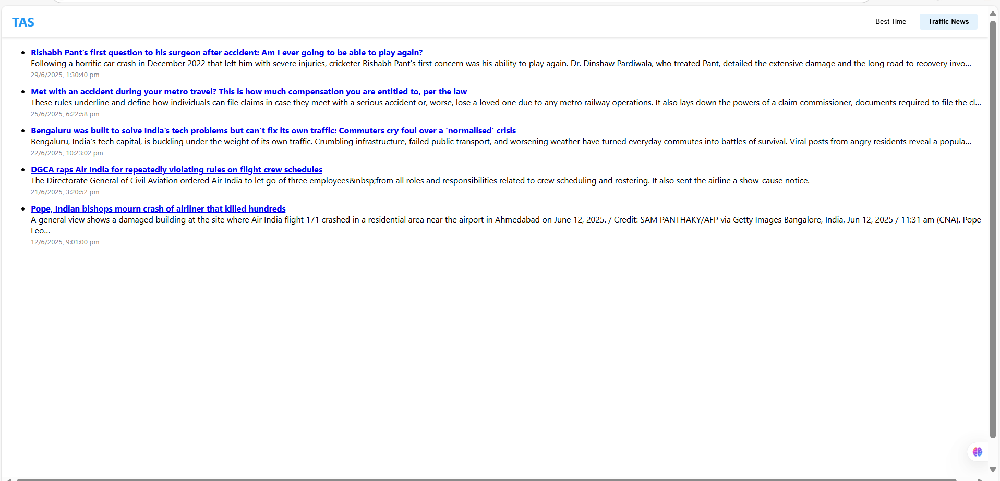
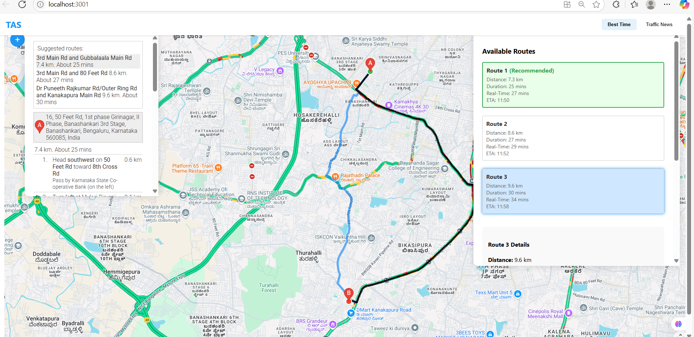

# TASS - Traffic Analysis and Smart Suggestions

A FastAPI backend for traffic route suggestions and news, designed for Bengaluru.

---

## Features

- 🚗 **Route Suggestions:** Get optimal routes using Google Directions API.
- 📰 **Traffic News:** Fetches latest Bangalore traffic news using NewsAPI.
- ⚠️ **Real-Time Alerts:** *Disabled* (API providers require payment method).

---

## Setup Instructions

### 1. Clone the Repository

```bash
git clone https://github.com/yourusername/tass-backend.git
cd tass-backend/backend
```

### 2. Install Dependencies

```bash
pip install -r requirements.txt
```

### 3. Environment Variables

Create a `.env` file in the `backend` directory:

```
google_cloud=YOUR_GOOGLE_MAPS_API_KEY
news_api_key=YOUR_NEWSAPI_KEY
```

### 4. Run the Server

```bash
uvicorn main:app --reload
```

The API will be available at [http://localhost:8000](http://localhost:8000).

---

## API Endpoints

- `POST /api/routes` — Get route suggestions between two locations.
- `GET /api/traffic-news` — Get latest Bangalore traffic news.
- `GET /api/alerts` — **Disabled** (returns nothing or a message).

---

## Screenshots

Add your screenshots to the `screenshots/` folder in your project root.

Example usage in README:

### Route Suggestion Example



### Traffic News Example



---

## Notes

- Real-time alerts are disabled due to API restrictions.
- For demo purposes, `/api/alerts` is commented out or returns a static message.

---

## License

MIT

---

## Author

[Venkatesh T](https://github.com/Venkateshtammina)
